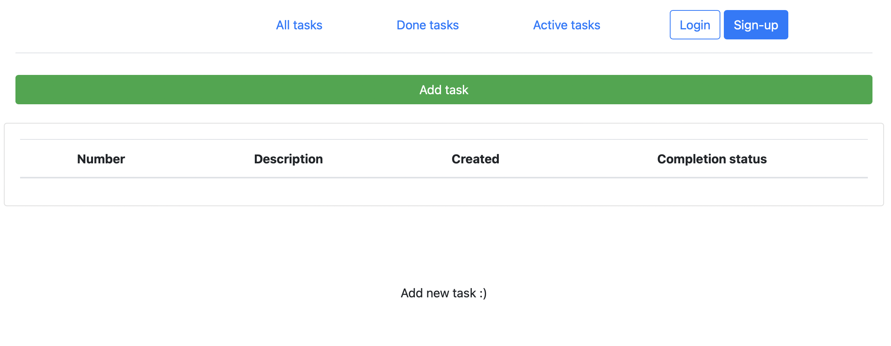
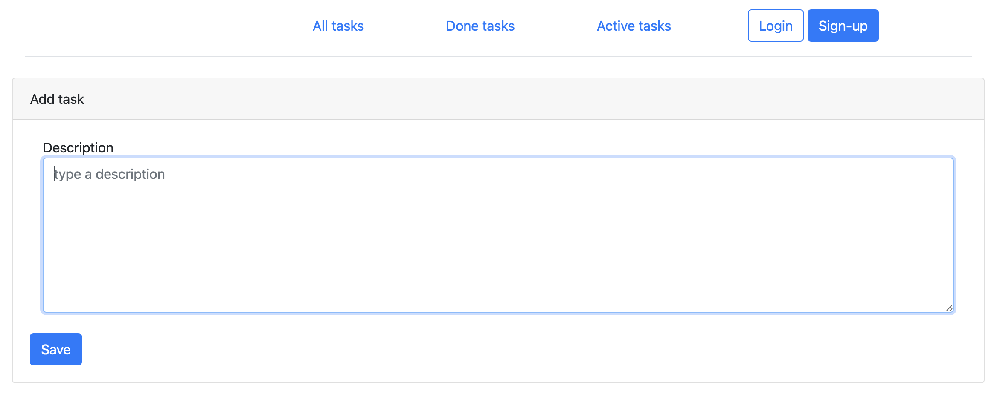
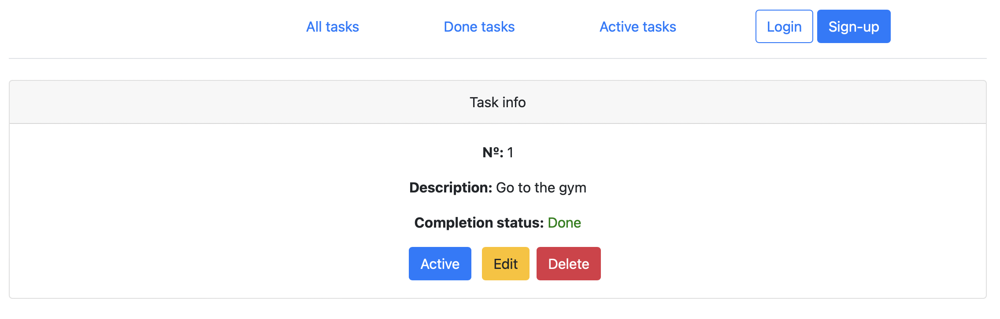
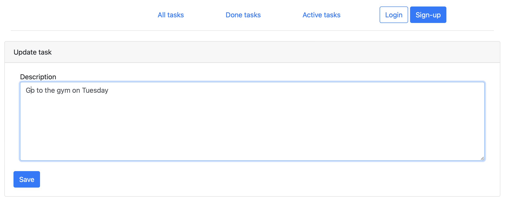
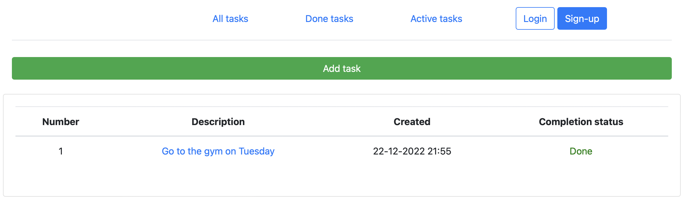

# Проект "TODO List"

## О проекте

Web-приложение для размещения списка задач. Позволяет составлять список дел и закрывать их по мере выполнения.

## Стек технологий

- **Сборка приложения в Maven**
- **Java 18**
- **Spring Boot**
- **Lombok**
- **Hibernate, HQL**
- **HTML, Thymeleaf, BOOTSTRAP,**

## Требования к окружению

 - **Java 18**
 - **Maven 3.8**
 - **PostgresSQL 14**

## Запуск проекта

- **Создать БД create database todo;**
- **Запустить проект по команде mvn spring-boot:run**

## Взаимодействие с приложением

Главное окно приложения содержит список задач с указаным статусом "Active" или "Done".
Для добавления задачи воспользуемся кнопкой "Add task".

Заполняем необходимую информацию и по умолчанию ставится статус "Active" и текущее время

Для уточнения полной информации задачи нужно кликнуть на описание

Здесь можно сменить статус на "Done"

Редактировать описание задачи

Удалить задачу

Вкладка "Done tasks"

Вкладка "Active tasks"

## Контакты

- liana.timirgazina@yandex.ru
- <a href="https://t.me/mymomsaysimcool/" target="_blank">Телеграм</a></h1>
   