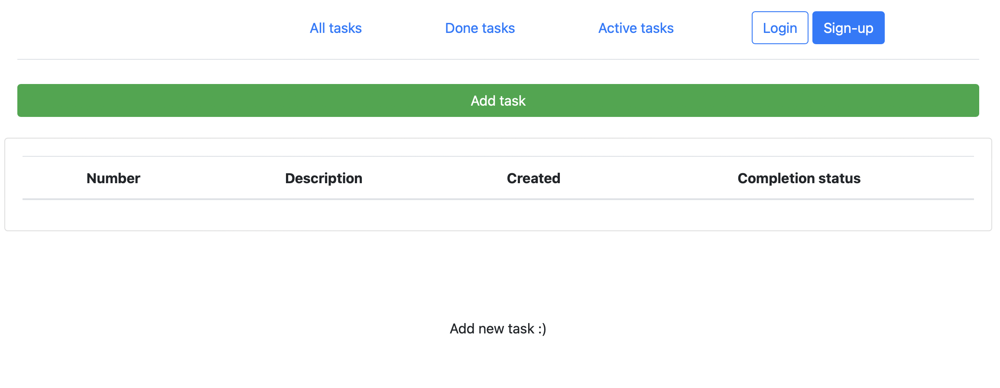
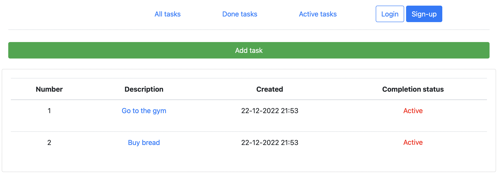
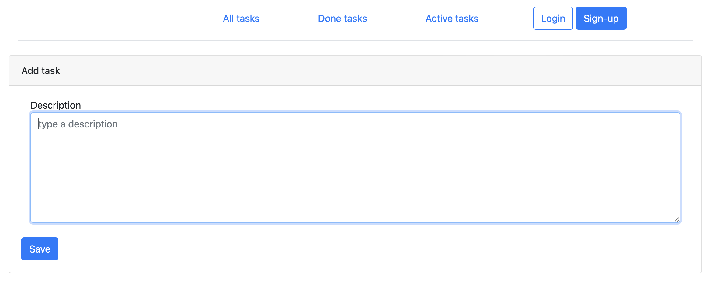
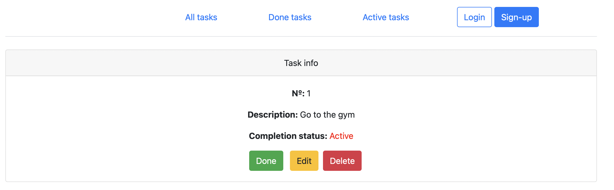
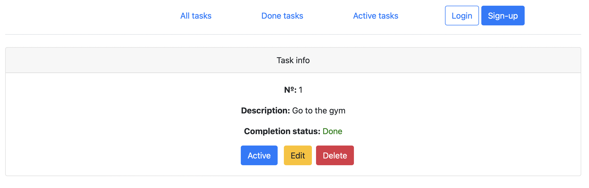
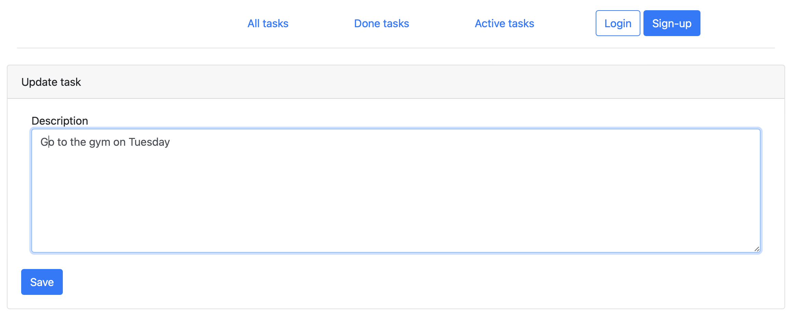
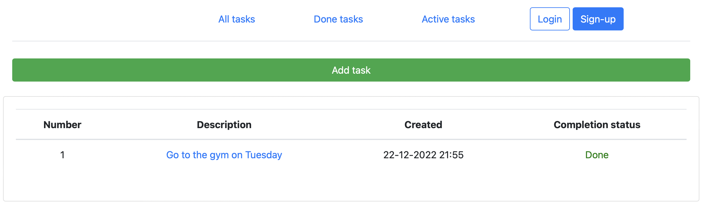
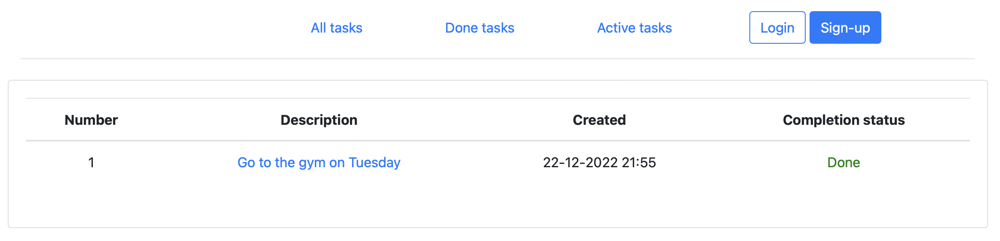
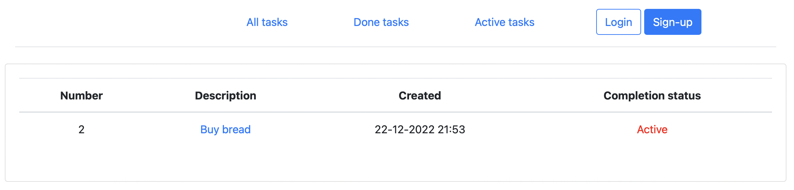

# Проект "TODO List"

## О проекте

Web-приложение для размещения списка задач. Позволяет составлять список дел и закрывать их по мере выполнения.

## Стек технологий

- **Сборка приложения в Maven 3.8**
- **Java 17**
- **Spring Boot 2.7.3**
- **Lombok 1.18.22**
- **Hibernate 5.6.11**
- **HTML 5**
- **Thymeleaf 2.7.3**
- **BOOTSTRAP 4.4.1**

## Требования к окружению

 - **Java 17**
 - **Maven 3.8**
 - **PostgresSQL 14**

## Запуск проекта

- **Создать БД ```create database todo;```**
- **Запустить проект по команде ```mvn spring-boot:run```**

## Взаимодействие с приложением

Главное окно приложения содержит список задач с указаным статусом "Active" или "Done".
Для добавления задачи воспользуемся кнопкой "Add task".




Заполняем необходимую информацию и по умолчанию ставится статус "Active" и текущее время



Для уточнения полной информации задачи нужно кликнуть на описание



Здесь можно сменить статус на "Done"



Редактировать описание задачи



Удалить задачу



Вкладка "Done tasks"



Вкладка "Active tasks"



## Контакты

- liana.timirgazina@yandex.ru
- <a href="https://t.me/mymomsaysimcool/" target="_blank">Телеграм</a></h1>
   